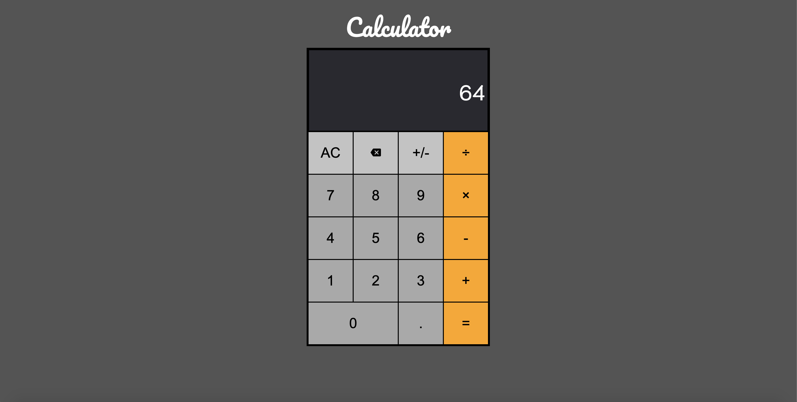

# Calculator

This is an awesome calculator built with vanilla JS.

> **Home page**

# 

## Table of contents

1. [Demo](#demo)
2. [Technologies](#technologies)
3. [Features](#features)

## Demo

Here is the working live demo:
[https://justinkar.github.io/calculator/](https://justinkar.github.io/calculator/).

## Technologies

- Javascript (ES6)

## Features

- Calculate using common operators
- Keyboard support
